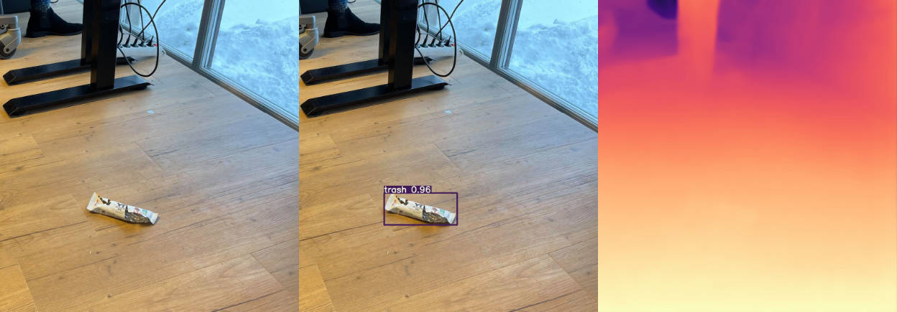

# MLAdy Vision <!-- omit in toc -->

All things related to vision 👀



## Table of Contents <!-- omit in toc -->

- [Vision (All modules combined)](#vision-all-modules-combined)
- [Detection (module) 🔍](#detection-module-)
  - [Quick Start 🚀](#quick-start-)
- [Depth (module) 🤽‍♂️](#depth-module-️)
  - [Quick Start 🚀](#quick-start--1)

## Vision (All modules combined)

Install [CUDA](https://developer.nvidia.com/cuda-toolkit-archive) (tested on 10.2)

Install [cuDNN](https://developer.nvidia.com/rdp/cudnn-download) (tested on 8.0.5 for CUDA 10.2)

Install [Anaconda](https://www.anaconda.com/products/individual)

Create the combined environment (Warning: Not yet tested - if it doesn't work, use the separate guides below)

```shell
conda env create -f environment.yml
```

_TODO: Combine detection and depth_

## Detection (module) 🔍

[YOLOv5](https://github.com/ultralytics/yolov5) with custom training to detect trash

See `train_trash_detection.ipynb` for training

Datasets used for training:

- [TACO](http://tacodataset.org/)

### Quick Start 🚀

Go into the `yolov5` folder

```shell
cd yolov5
```

Install requirements

```shell
pip install -r requirements.txt
```

Run inference

```shell
python detect.py --source "../input/trash.jpg" --weights "../detection_weights.pt" --img-size 640 --conf 0.675 --exist-ok --project ../ --name output
```

## Depth (module) 🤽‍♂️

[AdaBins](https://github.com/shariqfarooq123/AdaBins) with pretrained models to estimate depth map

Datasets used for training:

- [KITTI](http://www.cvlibs.net/datasets/kitti/eval_depth_all.php) *outdoors*
- [NYU](https://cs.nyu.edu/~silberman/datasets/nyu_depth_v2.html) *indoors*


### Quick Start 🚀

_The guide requires an NVIDIA GPU with CUDA-support._  
_CPU-only inference works, but training wise you're on your own._

Install [CUDA](https://developer.nvidia.com/cuda-toolkit-archive) (tested on 10.2)

Install [cuDNN](https://developer.nvidia.com/rdp/cudnn-download) (tested on 8.0.5 for CUDA 10.2)

Install [Anaconda](https://www.anaconda.com/products/individual)

Create virtual environment (tested on python 3.6.6)

```shell
conda create -n vision python=3.6.6 anaconda
```

Install PyTorch (tested on 1.7.0 and 1.7.1)

```shell
conda install pytorch torchvision cudatoolkit=10.2 -c pytorch
```

See [get started](https://pytorch.org/get-started/locally/) if not following previous recommendations, as you may want another version of PyTorch.

Install Taqaddum

```shell
conda install -c conda-forge tqdm
```

Run the setup

MacOS and Linux:
```shell
+chmod +x setup_depth.sh
./setup_depth.sh
```
For Windows:
```shell
setup_depth.sh
```

Test depth inference

```shell
python depth.py
```